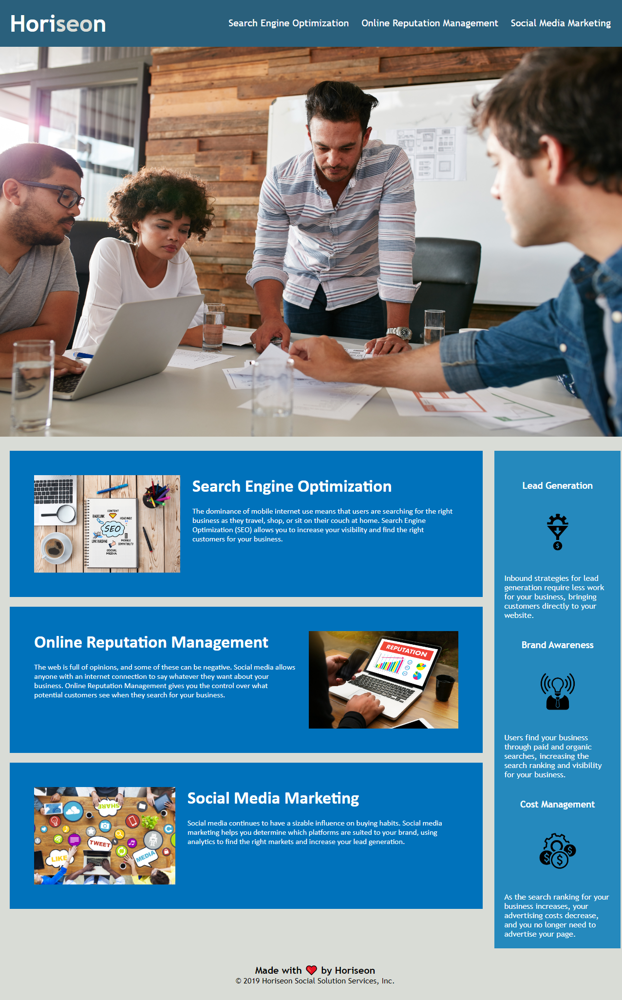

# Horiseon Challenge 

## Description

-For my first challenge was an On-The-Job ticket. This required me to modify & refactor some existing code.
A marketing agency has hired me to make thier site more accessible to the public and others with disabilities.

-When inpecting the code a few links of the site were not funtioning properly. The HTML required adding & changing the semantic elements as most were all classed as '
'. 

-The title was changed to something more suitable and clear. The CSS selectors were conolidated methodically and reaaranged to keep the flow logical with CSS & HTML structure.

-Additionally, comments were added to the CSS explaining some of the selectors purpose and functions.

-While working on this site, I learnt that though there may be a solution to an issue it may not be the best for the current problem. Searching for multipule solutions to a problem helps to ensure you find the appropriate one.

## Insallation

-Open index.html in browser to view the web page
-Open index.html in Visual Studio Code to view the code (if no VS code, open your developer window)
-Open style.css in Visual Studo Code to view the Cascading Style Sheet code and comments

## Usage 

## Credits

Tutorials used during this challenge:

https://www.w3schools.com/html/html_links.asp
https://www.w3schools.com/html/html_classes.asp
https://www.w3schools.com/html/html5_semantic_elements.asp
https://www.bitdegree.org/learn/responsive-image#:~:text=Using%20CSS%2C%20you%20can%20set,or%20bigger%20than%20the%20viewport.

## License 

N/A
